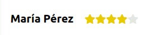

# Ejercicio 2 

Tenemos un nuevo componente UI para pintar las reviews.  

Como verás, ahora se pintan estrellas (hasta un máximo de 5) en lugar del número de la puntuación (siempre son números enteros). Queremos que se pinten en color @yellow-1 el número de estrellas que correspondan con la puntuación recibida. Es decir, si recibimos una review con un 4 de puntuación, debemos pintar las 4 primeras estrellas de color amarillo, y la última del color que está por defecto.

Verás que el número de la puntuación ya se está pintando en el DOM en un atributo. 

## Instrucciones:
- Tu código irá en el archivo answer2.less
- Si lo deseas, puedes cambiar lo que quieras del archivo exercise2.less para mejorar algo si lo crees conveniente y también para que te sientas más a gusto con el código (naming, formato, etc...).
- Deberías ser capaz de hacerlo sin tocar nada de JS en este ejercicio, por eso verás el HTML raw. Es decir, es *css-only*. En idealista utilizamos Less como preprocesador, pero si vienes de Sass no te costará mucho adaptarte, ya que su sintaxis y funcionalidad es muy parecida. Puedes consultar la documentación oficial de Less [aquí](http://lesscss.org/features/). En este ejercicio podrás sacarle partido a las funcionalidades de Less. 
- Tampoco deberías modificar el HTML excepto si quieres renombrar las clases. 

## Objetivo:
- Queremos ver cómo te manejas con CSS complejo y utilizando un preprocesador como Less. 

## Ejemplo de resultado: 

